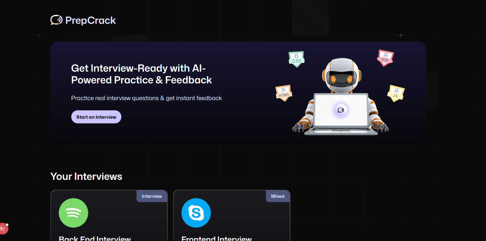
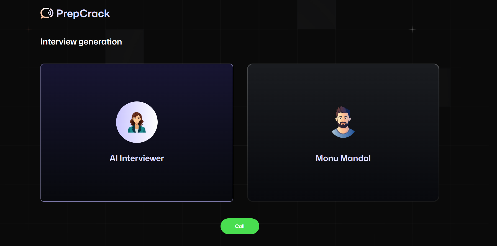
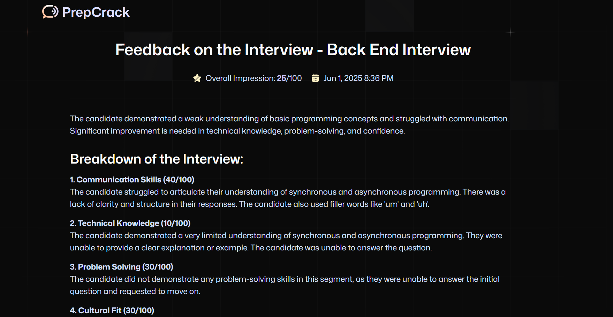

# PrepCrack

<p align="center">
   
</p>

<h1 align="center">🚀 PrepCrack</h1>
<p align="center">
  <b>AI-powered interview preparation platform</b><br>
  
  
  
  
</p>

<p align="center">
  <a href="#-features">✨ Features</a> •
  <a href="#-quickstart">⚡ Quickstart</a> •
  <a href="#-project-structure">📁 Project Structure</a> •
  <a href="#-customization">🛠️ Customization</a> •
  <a href="#-contributing">🤝 Contributing</a> •
  <a href="#-license">📝 License</a>
</p>

---

## ✨ Features

<p align="center">
  
  
  
  
</p>

- 🎤 **AI Voice Interviewer:** Practice interviews with a conversational AI that asks role-specific questions.
- 📝 **Instant Feedback:** Receive detailed, category-based feedback and scores after each interview.
- 💼 **Role & Tech Stack Customization:** Tailor interviews to specific roles, experience levels, and technologies.
- 📊 **Interview History:** Track your progress and review feedback from past interviews.
- 👥 **Community Interviews:** Access and take interviews created by other users.

---

## ⚡ Quickstart

```bash
git clone https://github.com/your-username/prepcrack.git
cd prepcrack
npm install
# or
yarn install
# or
pnpm install
# or
bun install
```

1. **Configure `.env.local`:**

   ```env
   NEXT_PUBLIC_VAPI_WEB_TOKEN=your_vapi_token
   NEXT_PUBLIC_BASE_URL=http://localhost:3000
   FIREBASE_PROJECT_ID=your_firebase_project_id
   FIREBASE_CLIENT_EMAIL=your_firebase_client_email
   FIREBASE_PRIVATE_KEY=your_firebase_private_key
   ```

2. **Run the app:**

   ```bash
   npm run dev
   # or
   yarn dev
   # or
   pnpm dev
   # or
   bun dev
   ```

3. **Open [http://localhost:3000](http://localhost:3000) in your browser.**

---

## 📁 Project Structure

- `app/` – Next.js app directory (routes, layouts, pages)
- `components/` – Reusable React components
- `constants/` – Static data and configuration
- `firebase/` – Firebase client and admin setup
- `lib/` – Utility functions and server actions
- `types/` – TypeScript type definitions
- `public/` – Static assets (images, icons, etc.)

---

## 🛠️ Customization

- **Interview Questions:** The AI generates questions based on the selected role, level, and tech stack.
- **Feedback Categories:** Feedback is structured into communication, technical knowledge, problem-solving, cultural fit, and confidence.

---

---

🖼️ Screenshots

<p align="center">    </p>

---

## 🤝 Contributing

Contributions, issues and feature requests are welcome!  
Feel free to check [issues page](../../issues) or submit a pull request.

---

## 📝 License

MIT License © [code-place7](https://github.com/code-place7)

---

<p align="center">
  <sub>Built with ❤️ using Next.js, Firebase, and AI APIs</sub>
</p>
